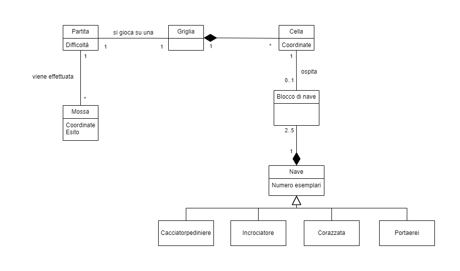
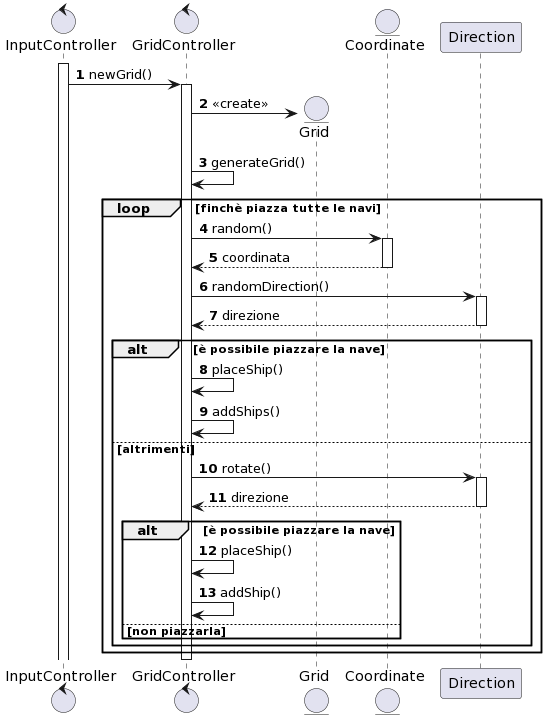
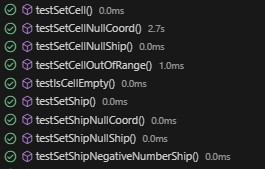
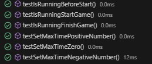
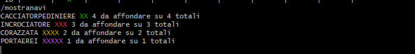
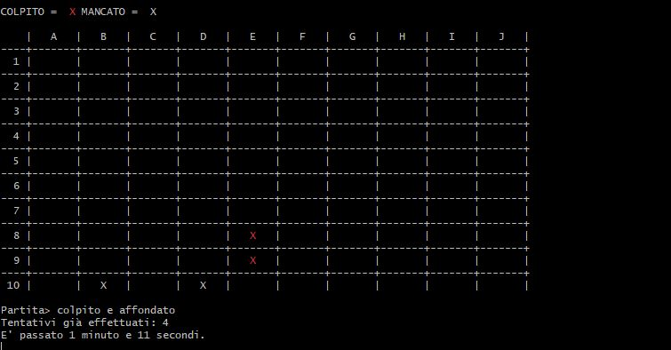
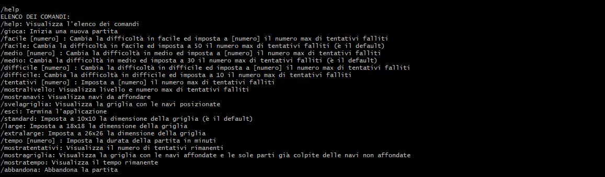
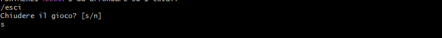

# Report

## Indice

1. [Introduzione](#1-introduzione)
2. [Modello di Dominio](#2-modello-di-dominio)
3. [Requisiti Specifici](#3-requisiti-specifici)
   - 3.1 [Requisiti funzionali](#31-requisiti-funzionali)
   - 3.2 [Requisiti non funzionali](#32-requisiti-non-funzionali)
4. [System Design](#4-system-design)
5. [OO Design](#5-oo-design)
   - 5.1 [Diagrammi delle classi](#51-diagrammi-delle-classi)
   - 5.2 [Diagrammi di sequenza](#52-diagrammi-di-sequenza)
   - 5.3 [Decisioni prese](#53-decisioni-prese)
   - 5.4 [Design Pattern](#54-design-pattern)
6. [Riepilogo del test](#6-riepilogo-del-test)
7. [Manuale Utente](#7-manuale-utente)
8. [Processo di sviluppo e organizzazione del lavoro](#8-Processo-di-sviluppo-e-organizzazione-del-lavoro)
9. [Analisi Retrospettiva](#9-analisi-retrospettiva)

## 1. Introduzione

**Battleship** è un'applicazione che permette di giocare a battaglia navale, con interfaccia a linea di comando (CLI). Per lo sviluppo delle implementazioni descritte in seguito si è formato un team denominato "Thompson" composto da cinque ragazzi del corso B del secondo anno di "informatica" dell'Università degli studi di Bari Aldo Moro durante l'A.A. 2022/23.

I componenti del gruppo sono:
<ul>
<li>Lorenzo Matera</li>
<li>Nicola Mastromarino</li>
<li>Leo Mastronardi</li>
<li>Emanuele Russo</li>
<li>Roberto Rotunno</li>
</ul>

[Torna all'indice](#indice)

## 2. Modello di dominio

[Torna all'indice](#indice)

## 3. Requisiti specifici

3.1 [Requisiti funzionali](#31-requisiti-funzionali)  
3.2 [Requisiti non funzionali](#32-requisiti-non-funzionali)

### 3.1 Requisiti funzionali

<ul>

<li><strong>RF1: Come giocatore voglio mostrare l'help con elenco comandi   Criteri di accettazione:
  </strong>
Al comando <strong>/help</strong> o invocando l'app con flag --help o -h
il risultato è una descrizione concisa, che normalmente appare all'avvio del programma, seguita dalla lista di comandi disponibili, uno per riga, come da esempio successivo:  
-gioca  
-esci  
-...  
</li>
<li><strong>RF2: Come giocatore voglio chiudere il gioco   Criteri di accettazione:  </strong>
Al comando <strong>/esci </strong>
l'applicazione chiede conferma 
se la conferma è positiva, l'applicazione si chiude restituendo il controllo al sistema operativo
se la conferma è negativa, l'applicazione si predispone a ricevere nuovi tentativi o comandi
</li>
<li><strong>RF3: Come giocatore voglio impostare il livello di gioco per variare il numero massimo di tentativi sbagliati  Criteri di accettazione:   </strong>
Al comando <strong>/facile </strong>
l’applicazione risponde con OK e imposta a 50 il numero massimo di tentativi falliti  
Al comando <strong>/medio </strong>
l’applicazione risponde con OK e imposta a 30 il numero massimo di tentativi falliti  
Al comando <strong>/difficile </strong>
l’applicazione risponde con OK e imposta a 10 il numero massimo di tentativi falliti  
</li>
<li><strong>RF4: Come giocatore voglio mostrare il livello di gioco e il numero di massimo di tentativi falliti  Criteri di accettazione:   </strong>
Al comando <strong>/mostralivello </strong> l’applicazione risponde visualizzando il livello di gioco e il numero di massimo di tentativi falliti
</li>
<li><strong>RF5: Come giocatore voglio mostrare i tipi di nave e i numeri  Criteri di accettazione:   </strong>
Al comando <strong>/mostranavi</strong> l’applicazione risponde visualizzando, per ogni tipo di nave, la dimensione in quadrati e il numero di esemplari da affondare: 
<ul>
<li>	Cacciatorpediniere 	⊠⊠ 		esemplari: 4 </li>
<li>	Incrociatore 		⊠⊠⊠ 		esemplari: 3 </li>
<li>	Corazzata 		⊠⊠⊠⊠ 		esemplari: 2 </li>
<li>	Portaerei  		⊠⊠⊠⊠⊠ 		esemplari: 1 </li>
</ul>
</li>
<li><strong>RF6: Come giocatore voglio iniziare una nuova partita  Criteri di accettazione:   </strong>
Al comando <strong>/gioca</strong> se nessuna partita è in corso l'applicazione imposta causalmente le navi, in orizzontale o in verticale, mostra la griglia vuota e si predispone a ricevere il primo tentativo o altri comandi. 
</li>
<li><strong>RF7: Come giocatore voglio svelare la griglia con le navi posizionate  Criteri di accettazione:   </strong>
Al comando <strong>/svelagriglia </strong> l’applicazione risponde visualizzando, una griglia 10x10, con le righe numerate da 1 a 10 e le colonne numerate da A a J, e tutte le navi posizionate  
</li>
<li><strong>RF8: Come giocatore voglio chiudere il gioco   Criteri di accettazione:  </strong>
Al comando <strong>/esci </strong>
l'applicazione chiede conferma 
se la conferma è positiva, l'applicazione si chiude restituendo il controllo al sistema operativo
se la conferma è negativa, l'applicazione si predispone a ricevere nuovi tentativi o comandi
</li>
<li><strong>RF9: Come giocatore voglio impostare il numero massimo di tentativi falliti per livello di gioco
   Criteri di accettazione:  </strong>
Al comando <strong>/facile </strong><i>numero</i> 
l’applicazione risponde con OK e imposta a <i>numero</i> il numero massimo di tentativi falliti  
Al comando <strong>/medio </strong><i>numero</i> 
l’applicazione risponde con OK e imposta a <i>numero</i> il numero massimo di tentativi falliti  
Al comando <strong>/difficile </strong><i>numero</i> 
l’applicazione risponde con OK e imposta a <i>numero</i> il numero massimo di tentativi falliti  
</li>
<li><strong>RF10: Come giocatore voglio impostare direttamente il numero massimo di tentativi che si possono fallire  Criteri di accettazione:  </strong>
Al comando <strong>/tentativi </strong>
l’applicazione risponde con OK e imposta a numero il numero massimo di tentativi falliti
</li>
<li><strong>RF11: Come giocatore voglio impostare la taglia della griglia   Criteri di accettazione:  </strong>
Al comando <strong>/standard </strong> 
l’applicazione risponde con OK e imposta a 10x10 la dimensione della griglia (è il default)  
Al comando <strong>/large </strong> 
l’applicazione risponde con OK e imposta a 18x18 la dimensione della griglia 
Al comando <strong>/extralarge </strong> 
l’applicazione risponde con OK e imposta a 26x26 la dimensione della griglia  
</li>
<li><strong>RF12: Come giocatore voglio impostare il tempo di gioco
  Criteri di accettazione:  </strong>
Al comando <strong>/tempo <i>numero</i></strong> l’applicazione risponde con OK e imposta a <i>numero</i> il numero minuti a disposizione per giocare
</li>
<li><strong>RF13: Come giocatore voglio mostrare il tempo di gioco
  Criteri di accettazione:  </strong>
Al comando <strong>/mostratempo </strong>
l’applicazione risponde visualizzando il numero di minuti trascorsi nel gioco e il numero di minuti ancora disponibili
</li>
<li><strong>RF14: Come giocatore voglio effettuare un tentativo per colpire una nave
  Criteri di accettazione:  </strong>
Digitando una coppia di caratteri separati da un trattino, corrispondenti rispettivamente al numero di riga e alla lettera della colonna, (es. B-4), l’applicazione risponde <ul>
<li>“acqua” se sulla cella non è posizionata nessuna nave;</li>
<li>"colpito" se sulla cella è posizionata una nave;</li>
<li>"colpito e affondato" se sulla cella è posizionata una nave ed è l’ultima cella non colpita della nave. </li></ul>
Qualunque sia l’esito del tentativo, l’applicazione mostra la griglia con le navi colpite parzialmente o affondate, il numero di tentativi già effettuati, e il tempo trascorso.  
La partita termina con successo se il tentativo ha affondato l’ultima nave.  
La partita termina con insuccesso se è stato raggiunto il numero massimo di tentativi falliti o se è scaduto il tempo di gioco. 
</li>
<li><strong>RF15: Come giocatore voglio mostrare la griglia con le navi colpite e affondate
  Criteri di accettazione:  </strong>
Al comando <strong>/mostragriglia </strong>
l’applicazione risponde visualizzando, una griglia con le righe numerate a partire da 1 e le colonne numerate a partire da A, con le navi affondate e le sole parti già colpite delle navi non affondate. 
</li>
<li><strong>RF16: Come giocatore voglio mostrare il numero di tentativi già effettuati e il numero di tentativi falliti </strong>
Al comando <strong>/mostratentativi </strong>
l’applicazione risponde visualizzando il numero di tentativi già effettuati, il numero di tentativi falliti e il numero massimo di tentativi falliti
</li>
<li><strong>RF17: Come giocatore voglio abbandonare una partita
  Criteri di accettazione:  </strong>
Al comando <strong>/abbandona </strong>
l’applicazione chiede conferma
<ul>
<li>se la conferma è positiva, l’applicazione risponde visualizzando sulla griglia la posizione di tutte le navi e si predispone a ricevere nuovi comandi</li>
<li>se la conferma è negativa, l'applicazione si predispone a ricevere nuovi tentativi o comandi</li>
</ul></li>
</ul>

### 3.2 Requisiti non funzionali
<ul>
<li> 
<strong>RNF1: Il container docker dell'app deve essere eseguito da terminali che supportano Unicode con encoding UTF-8 o UTF-16</strong> 
Elenco di terminali supportati 
Linux: 
- terminal 
Windows 
- Powershell 
- Git Bash (in questo caso il comando Docker ha come prefisso winpty; es: winpty docker -it ...) 

**Comando per l’esecuzione del container** 
Dopo aver eseguito il comando docker pull copiandolo da GitHub Packages, Il comando Docker da usare per eseguire il container contenente l’applicazione è: 

`docker run --rm -it ghcr.io/softeng2223-inf-uniba/battleship-thompson:latest`

</li>
</ul>

[Torna all'indice](#indice)

## 4. System Design

<strong>Questa sezione non è compilata</strong>: il gruppo dopo un'analisi del problema ha opportunamente deciso che non avrebbe avuto senso esplicitare un design del sistema, in quanto si tratta di un progetto di <i>piccole-medie</i> dimensioni.</i>

[Torna all'indice](#indice)

## 5. OO Design
5.1 [Diagrammi delle classi](#51-diagrammi-delle-classi) 
5.2 [Diagrammi di sequenza](#52-diagrammi-di-sequenza) 
5.3 [Decisioni prese](#53-decisioni-prese) 
5.4 [Design Pattern](#54-design-pattern) 
### 5.1 Diagrammi delle classi
 
 

 

[Torna all'indice](#indice)

### 5.2 Diagrammi di sequenza

 

 

[Torna all'indice](#indice)

### 5.3 Decisioni prese
Durante la progettazione delle classi, abbiamo seguito il principio di information hiding per garantire l'incapsulamento dei dati. 
Tutte le variabili di istanza sono state dichiarate private, assicurando che i dati siano accessibili solo attraverso metodi getter e setter. 
Solo le operazioni necessarie sono state dichiarate pubbliche, mentre le altre sono state mantenute private o protette. 

L'applicazione del principio di information hiding ha comportato una riduzione dell'accoppiamento tra le classi.
Questo significa che una classe esterna può interagire con un oggetto senza conoscere i dettagli interni della sua implementazione.
Ciò promuove una maggiore modularità e facilita la manutenzione del sistema. 

Inoltre, abbiamo suddiviso le classi in Entity/Control/Boundary, seguendo il principio di presentazione separata.
Ogni classe ha una responsabilità specifica: le classi entity si occupano di implementare i concetti chiave del gioco, le classi control contengono gran parte della logica del programma, mentre le classi boundary gestiscono l'interazione con l'utente e la presentazione dei dati. 

Abbiamo applicato il principio DRY in diverse occasioni per migliorare la manutenibilità, la leggibilità e la gestione del codice.
Ad esempio, abbiamo consolidato diversi metodi utilizzati per la stampa della griglia in un unico metodo, riducendo così la duplicazione di codice.
Inizialmente, avevamo creato metodi separati per ciascuna dimensione della griglia, che differivano solo per alcune righe di codice relative alla formattazione.
Successivamente, abbiamo ristrutturato il codice per evitare questa duplicazione e semplificare la gestione futura del codice.

 

 

 

Per le classi boundary, è stato scelto di dichiararle astratte al fine di minimizzare il numero di dipendenze. Inoltre, sono stati definiti eventuali metodi astratti per calcolare risultati o modificare il flusso di controllo, permettendo ai controller di implementarli. Questa scelta aiuta a separare la parte di presentazione dalla logica di business e favorisce una maggiore modularità nel sistema.

[Torna all'indice](#indice)

### 5.4 Design pattern
Per le classi control (InputController, GridController, TimerController), è stato applicato il design pattern Singleton per garantire che esista solo un'istanza di queste classi durante l'esecuzione del programma.
Il design pattern Singleton è stato implementato nascondendo il costruttore delle classi e definendo un metodo statico chiamato "getInstance" che restituisce l'unica istanza della classe.
La scelta di tale pattern risiede nel fatto di fornire un unico punto di accesso per interagire con le istanze delle classi control, semplificando l'utilizzo e la gestione delle funzionalità offerte da queste classi ed evitare la creazione di istanze multiple che potrebbero causare problemi di inconsistenza dei dati.

L'utilizzo di questo design pattern ha portato a segnalazioni di warning da parte di SpotBugs. Tuttavia, tali avvertenze sono state ignorate al fine di implementare correttamente il design pattern.
 

[Torna all'indice](#indice)

## 6. Riepilogo del test
I test sono stati eseguiti utilizzando il framework JUnit.
Sono state create 14 test suite, per un totale di 154 test complessivi, tutti superati con successo.
Ogni test suite è stata correttamente inserita nella cartella "test", rispettando la stessa struttura della cartella del codice sorgente. Ogni test suite corrisponde a una classe del codice sorgente ed è stata denominata "\<nomeclasse>Test.java", posizionandola nella cartella corrispondente.

   <table width="100%" height="100%" valign="center">
   <tr><td>
      
   </td><td>
      
   </td>
   </tr>
   </table>

Per le classi entity e control, sono stati adottati principalmente criteri di tipo black box. Per ciascun metodo, il dominio dei dati in ingresso è stato suddiviso in classi di equivalenza e sono stati scelti valori appropriati per ciascuna classe. Per le classi boundary, non sono stati eseguiti test in quanto è stato applicato il principio di presentazione separata.

   <table width="100%" height="100%" valign="center">
   <tr><td>
      
   </td><td>
      
   </td>
   </tr>
   </table>

[Torna all'indice](#indice)

## 7. Manuale utente

7.1 [Comandi invocabili prima della partita](#71-comandi-invocabili-prima-della-partita)  
7.2 [Comandi invocabili durante la partita](#72-comandi-invocabili-durante-la-partita)  
7.3 [Comandi invocabili sempre](#73-comandi-invocabili-sempre)

Il gioco si svolge su una griglia, dove il sistema posiziona in modo casuale le navi all'inizio di una partita. L'obiettivo del giocatore è quello di indovinare la posizione delle navi nemiche e cercare di affondarle attaccando le caselle della griglia prima che finisca il tempo a disposizione. 
Il gioco termina quando tutte le navi nemiche sono state affondate, quando si esauriscono le mosse disponibili o quando scade il tempo a disposizione.
Il numero di mosse disponibili dipende dalla modalità di gioco scelta, che può essere facile, media o difficile. 
Il giocatore vince se affonda tutte le navi prima di esaurire le mosse e prima che termini il tempo.
 

Per interagire con il gioco, viene utilizzata l'interfaccia a riga di comando (CLI). Di seguito si riporta l'elenco dei comandi utilizzabili e una breve descrizione del loro funzionamento, suddivisi in tre sezioni:
 

### 7.1 Comandi invocabili prima della partita
<li>Al comando <strong>/facile</strong> l’applicazione risponde con OK e imposta a 50 il numero massimo di tentativi falliti.</li> 

<li>Al comando <strong>/medio</strong> l’applicazione risponde con OK e imposta a 30 il numero massimo di tentativi falliti (è il default).</li> 

<li>Al comando <strong>/difficile</strong> l’applicazione risponde con OK e imposta a 10 il numero massimo di tentativi falliti. 
</li> 

<li>Al comando <strong>/facile</strong> <i>numero</i> l’applicazione risponde con OK e imposta a <i>numero</i> il numero massimo di tentativi falliti. </li> 

<li>Al comando <strong>/medio</strong> <i>numero</i> l’applicazione risponde con OK e imposta a <i>numero</i> il numero massimo di tentativi falliti.</li> 

<li>Al comando <strong>/difficile</strong> <i>numero</i> l’applicazione risponde con OK e imposta a <i>numero</i> il numero massimo di tentativi falliti.</li> 

<li>Al comando <strong>/tentativi</strong> <i>numero</i> l’applicazione risponde con OK e imposta a <i>numero</i> il numero massimo di tentativi falliti.</li> 

<li>Al comando <strong>/standard</strong> l’applicazione risponde con OK e imposta a 10x10 la dimensione della griglia (è il default).</li> 

<li>Al comando <strong>/large</strong> l’applicazione risponde con OK e imposta a 18x18 la dimensione della griglia.</li> 

<li>Al comando <strong>/extralarge</strong> l’applicazione risponde con OK e imposta a 26x26 la dimensione della griglia.</li> 

<li>Al comando <strong>/tempo</strong> <i>numero</i> l’applicazione risponde con OK e imposta a <i>numero</i> il numero minuti a disposizione per giocare.</li> 

<li>Al comando <strong>/gioca</strong> se nessuna partita è in corso l'applicazione imposta causalmente le navi, in orizzontale o in verticale, mostra la griglia vuota e si predispone a ricevere il primo tentativo o altri comandi.</li> 

### 7.2 Comandi invocabili durante la partita

<li>Al comando <strong>/mostranavi</strong> l’applicazione risponde visualizzando, per ogni tipo di nave, la dimensione in quadrati e il numero di esemplari da affondare: 
<ul>
<li>	Cacciatorpediniere 	⊠⊠ 		esemplari: 4 </li>
<li>	Incrociatore 		⊠⊠⊠ 		esemplari: 3 </li>
<li>	Corazzata 		⊠⊠⊠⊠ 		esemplari: 2 </li>
<li>	Portaerei  		⊠⊠⊠⊠⊠ 		esemplari: 1 </li>
</ul>
</li> 

<li>Digitando una coppia di caratteri separati da un trattino, corrispondenti rispettivamente al numero di riga e alla lettera della colonna, (es. <strong>B-4</strong>), l’applicazione risponde:
<ul>
<li>“acqua” se sulla cella non è posizionata nessuna nave;</li>
<li>"colpito" se sulla cella è posizionata una nave;</li>
<li>"colpito e affondato" se sulla cella è posizionata una nave ed è l’ultima cella non colpita della nave.</li>
</ul>
Qualunque sia l’esito del tentativo, l’applicazione mostra la griglia con le navi colpite parzialmente o affondate, il numero di tentativi già effettuati e il tempo trascorso. 
La partita termina con successo se il tentativo ha affondato l’ultima nave. 
La partita termina con insuccesso se è stato raggiunto il numero massimo di tentativi falliti o se è scaduto il tempo di gioco.</li> 

<li>Al comando <strong>/mostratempo</strong> l’applicazione risponde visualizzando il numero di minuti trascorsi nel gioco e il numero di minuti ancora disponibili.</li> 

<li>Al comando <strong>/mostragriglia</strong> l’applicazione risponde visualizzando, una griglia con le righe numerate a partire da 1 e le colonne numerate a partire da A, con le navi affondate e le sole parti già colpite delle navi non affondate.</li> 

<li>Al comando <strong>/mostratentativi</strong> l’applicazione risponde visualizzando il numero di tentativi già effettuati, il numero di tentativi falliti e il numero massimo di tentativi falliti.</li> 

<li>Al comando <strong>/svelagriglia</strong> l’applicazione risponde visualizzando, una griglia 10x10, con le righe numerate da 1 a 10 e le colonne numerate da A a J, e tutte le navi posizionate.</li> 

<li>Al comando <strong>/abbandona</strong> l'applicazione chiede conferma:
<ul>
<li>se la conferma è positiva, l’applicazione risponde visualizzando sulla griglia la posizione di tutte le navi e si predispone a ricevere nuovi comandi;</li>
<li>se la conferma è negativa, l'applicazione si predispone a ricevere nuovi tentativi o comandi.</li>
</ul>
</li> 

### 7.3 Comandi invocabili sempre
<ul>
<li>Al comando <strong>/help</strong> o invocando l'app con flag <i>--help</i> o <i>-h</i> il risultato è una descrizione concisa, che normalmente appare all'avvio del programma, seguita dalla lista di comandi disponibili, uno per riga, come da esempio successivo: 
<ul>
<li>	gioca </li>
<li>	esci </li>
</ul>
</li> 
Si nota che se all'avvio del programma viene specificato un flag diverso da <i>--help</i> o <i>-h</i>, o vengono specificati più flag, l'applicazione risponde con un messaggio di errore e si chiude restituendo il controllo al sistema operativo. In caso non sia specificato alcun flag, l'applicazione mostra esclusivamente l'introduzione e si predispone a ricevere comandi. 
 

<li>Al comando <strong>/mostralivello</strong> l’applicazione risponde visualizzando il livello di gioco e il numero di massimo di tentativi falliti.</li> 

<li>Al comando <strong>/esci</strong> l’applicazione risponde visualizzando il livello di gioco e il numero di massimo di tentativi falliti 
<ul>
<li>	se la conferma è positiva, l'applicazione si chiude restituendo il controllo al sistema operativo</li>
<li>	se la conferma è negativa, l'applicazione si predispone a ricevere nuovi tentativi o comandi</li>
</ul>
</li> 

</ul>

[Torna all'indice](#indice)

## 8. Processo di sviluppo e organizzazione del lavoro
   Per il processo di sviluppo e l'organizzazione del lavoro abbiamo seguito il metodo <strong>SCRUM</strong>, dove i progetti fanno progessi in una serie di consegne dette Sprint. Nel nostro caso, il metodo SCRUM prevede l'intero progetto suddiviso in 3 sprint (Sprint 0, 1, 2). Ogni sprint ha una durata di circa 2 settimane e ognuno di questi sprint è stato svolto seguendo il [codice di condotta](./CODE_OF_CONDUCT.md).
   Abbiamo suddiviso il lavoro in base alle user story fornite dal product owner, in modo da avere un carico di lavoro equilibrato fra tutti i componenti del team.

   Durante le pause o prima delle lezioni, si tenevano anche meeting non periodici. Questi incontri aggiuntivi avevano l'obiettivo di discutere e risolvere eventuali problemi. I meeting periodici venivano svolti ogni 2/3 giorni, escludendo la domenica, ed avevano la durata di massimo 30 minuti ed erano effettuati attraverso un canale privato di comunicazione sulla piattaforma Discord, questi meeting periodici avevano l'obiettivo di aggiornarci su eventuali problemi riscontrati, <strong>Discord</strong> veniva anche usato per la condivisione di file utili, oppure per programmare e confrontarsi. In alcuni giorni abbiamo anche deciso di lavorare tutti insieme in presenza o anche su Discord. Inoltre per le comunicazioni veloci durante l'arco della giornata è stata usata un'altra piattaforma di comunicazione, Whatsapp. 

   Discord mette a disposizione la creazione di diversi canli (vocali e testuali) per questo il server è stato strutturato come segue per mantere l'ordine e l'organizzazione:

   

   Subito dopo ogni feedback/lancio dello sprint ci siamo riuniti in presenza per prendere nota e correggere gli errori che erano emersi dalla revisione del Product Owner. Dopodichè abbiamo pianificato il lavoro da svolgere per il nuovo sprint, definendo:
   <ul>
   <li> Milestone legato allo sprint;</li>
   <li> Sprint board con le colonne <i>Todo</i>, <i>In Progress</i>, <i>Review</i>, <i>Ready</i> e <i>Done</i>;</li>
   <li> Issue da assegnare ai componenti del team;</li>
   <li> Successivamente: completata una issue, uno o più componenti, selezionati come reviewers, revisionavano le modifiche effettuate.</li>
   </ul>
 
   Per i punti precedenti abbiamo usato: 
   <ul>
   <li> <i>GitHub</i> per il coordinamento del lavoro e l'issue tracking;</li>
   <li> <i>Git</i> per il controllo di versione;</li>
   <li> <i>GitHub Flow</i> per Branching e Pull Request;</li>
   </ul>
  Per la stesura del progetto, come ambiente di sviluppo, abbiamo usato l'IDE Visual Studio Code con i sui plug-in: Gradle, GitHub e PlantUML.
  Altri Software utilizzati sono stati: 
   <ul>
   <li> <i>Miro</i> per l'analisi retrospettiva;</li>
   <li> <i>Docker</i> per l'utilizzo di container;</li>
   <li> <i>PlantUML</i> per i diagrammi di dominio e delle classi;</li>
   <li> <i>Netbeans</i> come IDE secondario;</li>
   </ul>

[Torna all'indice](#indice)

## 9. Analisi retrospettiva

9.1 [Sprint 0](#91-sprint-0)  
9.2 [Sprint 1](#92-sprint-1)

### 9.1 Sprint 0
   

### 9.2 Sprint 1

[Torna all'indice](#indice)